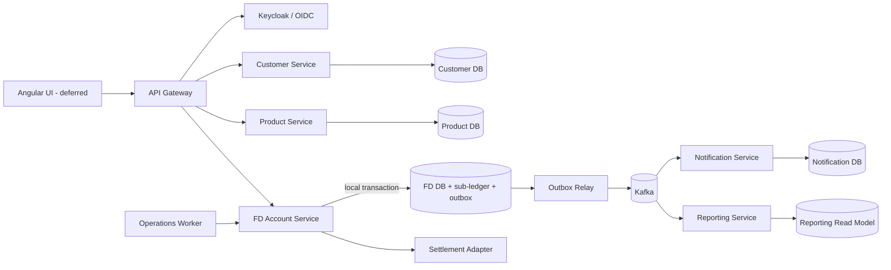

# Backend-First Industry Implementation Plan

**Project:** Fixed Deposit Banking Platform  
**Plan date:** 2026-10-03  
**Priority:** Backend correctness, data integrity, testing, and operability before frontend work  
**Target runtime:** Java 21 LTS (Eclipse Temurin), Spring Boot 3.5.x, Spring Cloud 2025.0.x  
**Migration style:** Incremental strangler migration; no big-bang rewrite

## 1. Executive decision

The repository is not currently a Java 21 project. Both Java modules, their Docker images, CI, and documentation currently target Java 17. The remediation target will be Java 21, but the Java upgrade must be performed as a controlled platform phase rather than mixed into financial-logic changes.

The existing FD lifecycle work is valuable and should be preserved. The target is not to rewrite the application. The target is to stabilize it, close correctness and security gaps, establish reliable contracts, and then extract clear bounded contexts into independently deployable services with database-per-service ownership.

The current frontend is frozen except for security or API-compatibility fixes. A frontend redesign is explicitly out of scope until the backend quality gates have passed. It may be skipped entirely for the first production-quality backend milestone.

## 2. Current audited baseline

### 2.1 What already exists

- Angular user interface.
- Spring Cloud API Gateway.
- Spring Boot FD backend.
- MySQL persistence with Flyway migrations.
- Kafka-based lifecycle event integration.
- Python notification service.
- Python reporting service.
- Docker Compose, Kubernetes resources, Mailpit, and GitHub Actions.
- Product configuration, FD account opening, interest calculation, transactions, statements, withdrawals, maturity, and notification flows.
- Recent local changes implementing a more realistic distinction between daily accrual, capitalization, payout, maturity, and renewal.
- Migrations V16 and V17 for the newer financial lifecycle.
- A cached test result of 34 passing tests and an existing Angular build. These results are historical evidence, not proof of the current uncommitted working tree.

### 2.2 Repository state that must be protected first

- Branch: `codex/integration-ready-fd`.
- Remote branch and `main` are at commit `ffcce3a2`.
- The most recent implementation spans 62 local paths: 49 modified and 13 untracked.
- Therefore, the newest business logic is neither fully committed nor pushed.
- Docker services were stopped at the time of the audit.
- Report, presentation, and demo video predate the newest lifecycle implementation.

### 2.3 Confirmed gaps and risks

#### Critical

1. Public registration accepts a caller-selected role, which permits role escalation unless corrected.
2. The newest lifecycle implementation is uncommitted and unpushed.
3. Demonstration deliverables do not describe the newest implementation.

#### High

4. Financial precision is inconsistent between daily accrual and transaction amounts, creating reconciliation risk.
5. Premature-closure and day-count terms are read from the current product instead of being completely snapshotted onto an opened FD.
6. FD account opening has no robust idempotency key.
7. Payouts are ledger simulations; no settlement account or payment adapter completes a transfer.
8. Kafka publication is not protected by a transactional outbox, so a database commit can succeed while event publication is lost.
9. Notification retry and deduplication semantics can permanently suppress a failed delivery or duplicate a delivery after a partial failure.
10. Scheduled jobs are not protected against simultaneous execution by multiple replicas.

#### Medium

11. Multi-currency support is incomplete: some calculator, penalty, report, and notification paths assume INR or two decimal places.
12. Account opening accepts an arbitrary start date without a documented backdating/future-dating policy.
13. Administrative time travel is insufficiently bounded and audited.
14. Product compatibility between compounding and payout choices is undefined.
15. Late renewal currently risks creating an unexplained earnings gap because the effective renewal date policy is undefined.
16. Registration does not guarantee creation/linking of a customer profile.
17. Product update semantics reuse create validation and are not a true, safe partial update contract.
18. Authentication lacks production-grade token lifecycle, revocation, secure secret handling, and rate limiting; the frontend stores JWT data in browser storage.
19. The report service trusts gateway-provided identity headers and is safe only if it is unreachable except through a trusted internal path.
20. Daily customer notifications for interest accrual can create excessive noise and operational cost.
21. Tests do not yet cover all currencies, all lifecycle frequencies, concurrency, event-loss recovery, duplicate execution, or cross-service contracts.
22. CI does not prove the full MySQL/Kafka/notification/report stack through end-to-end tests.

#### Documentation drift

23. Test evidence states 27 tests while cached reports contain 34.
24. The ER diagram describes an older nine-table model and outdated interest-credit accounting.
25. An FD README describes the calculator as public although the controller requires an authenticated customer.
26. OpenAPI, event schema, report, presentation, video, and runbook must be regenerated from the final behavior.

## 3. Target architecture

### 3.1 Principles

- Each service owns a business capability and its data.
- No service reads another service's database.
- No distributed database transaction is attempted.
- Local state change and event publication use an outbox in one local transaction.
- Every command crossing a process boundary is idempotent.
- APIs and events are versioned contracts.
- Financial state transitions are explicit, auditable, and invariant-checked.
- Services are independently buildable, testable, deployable, observable, and scalable.
- Extraction is incremental; the running system remains demonstrable after every phase.

### 3.2 Target services and ownership

| Service | Responsibility | Owned data | Notes |
|---|---|---|---|
| API Gateway | Edge routing, request limits, CORS, correlation, token relay | None | Contains no FD business logic |
| Identity Provider | Authentication, users, roles, MFA-ready identity | Identity store | Use Keycloak locally/free; Azure Entra can be added later |
| Customer Service | Customer profile and status | Customer database | Exposes stable customer IDs; no FD tables |
| Product Service | Versioned FD products, rate/tenure/frequency/currency rules | Product database | Published versions are immutable |
| FD Account Service | Account opening, terms snapshot, balances, accrual, capitalization, payout, maturity, withdrawal | FD database, local sub-ledger, outbox/inbox | Core transactional boundary |
| Settlement Adapter | Transfer requests to/from linked accounts | Settlement records | Initially a deterministic simulator; replaceable later |
| Notification Service | Templates, preferences, delivery attempts, retry/dead-letter handling | Notification database | Consumes events; never reads FD DB |
| Reporting Service | Statements, liability views, downloadable reports | Reporting read-model database/object store | Builds projections from events/APIs; never reads FD DB |
| Operations Worker | Triggers dated processing in bounded batches | Job execution metadata | Calls idempotent FD commands; one logical run per date/partition |

The FD Account Service should retain its local financial sub-ledger so account state and its postings commit atomically. If a team-wide central GL exists later, it consumes reliable posting events; it must not be introduced by splitting the one transaction that protects FD balance integrity.

### 3.3 Communication rules

- REST/HTTP for immediate validation and commands whose result is required by the caller.
- Kafka for facts that have already occurred: `FdOpened`, `InterestAccrued`, `InterestCapitalized`, `InterestPaid`, `FdMatured`, `FdRenewed`, and `FdPrematurelyClosed`.
- Transactional outbox from every event-producing service.
- Consumer inbox/deduplication keyed by event ID.
- OpenAPI for synchronous APIs and AsyncAPI/JSON Schema for events.
- Backward-compatible additions within a major contract version; breaking changes require a new version/topic or endpoint.
- Correlation ID, causation ID, trace ID, event ID, aggregate ID, schema version, occurred-at, and producer on every integration event.

### 3.4 Target flow



## 4. Financial model decisions

### 4.1 Money and precision

- Never use `float` or `double` for money, rates, factors, or intermediate interest calculations.
- Use a value object for currency-aware money and `BigDecimal` with explicit scale and rounding.
- Use `DECIMAL(24,6)` for account balances, accrued interest, transactions, and local-ledger postings for the project baseline.
- Use higher precision, such as scale 12, for intermediate rate/day calculations; round once when creating the financial record.
- Store currency as ISO 4217 code and validate it against supported product currencies.
- Centralize currency minor-unit rules for external display and settlement. Do not scatter `setScale(2)` through services.
- Define a documented rounding mode. The proposed baseline is `HALF_EVEN` for accounting amounts.
- Make any rounding residual explicit and reconcilable; never silently discard it.

### 4.2 Product version and FD term snapshot

Every account stores an immutable snapshot of the contract accepted at opening:

- product code and product version ID;
- annual interest rate;
- currency;
- principal and current balance;
- tenure and start/maturity dates;
- compounding frequency;
- payout frequency;
- maturity instruction;
- day-count convention;
- premature-closure allowed flag and penalty rule/rate;
- applicable business-calendar/time-zone rule;
- accepted terms timestamp.

Editing a product creates a new product version. It never mutates the economic terms of an active FD.

### 4.3 State machine and invariants

Use an explicit state transition policy rather than scattered status assignments.

```text
PENDING_FUNDING -> ACTIVE -> MATURED -> PAID_OUT
                         \-> RENEWED
                 \-> PREMATURELY_CLOSED
                 \-> BLOCKED/FAILED_SETTLEMENT (operational state, recoverable)
```

Core invariants:

- principal remains the original funded principal;
- current balance changes only through funding, capitalization, withdrawal/closure, maturity payout, or controlled correction;
- accrued interest is not part of current balance until capitalization;
- one accrual exists per FD/effective date;
- one capitalization exists per FD/schedule boundary;
- one maturity outcome exists per FD;
- every balance-changing transaction has balanced debit/credit postings;
- account currency never changes;
- active contractual terms cannot be freely edited;
- customer-visible money equals the sum of traceable financial events.

### 4.4 Date policies

- Start date is not the record creation date.
- Backdating and future dating require explicit limits and a privileged operation.
- Calendar frequencies use `plusMonths`, not fixed day counts.
- The processing time zone is configured and persisted with the business date.
- Initial convention remains `ACTUAL/365`; the account snapshots it.
- Leap year behavior is tested explicitly.
- Late processing accrues all missed dates exactly once.
- Late maturity and renewal use a documented effective-date rule. Proposed rule: process financial effects as of the contractual maturity date and record the later processing timestamp separately.

### 4.5 Accounting event semantics

| Event | Debit | Credit | Balance effect |
|---|---|---|---|
| Deposit funded | Settlement/clearing asset | FD deposit liability | Principal and current balance increase |
| Daily accrual | Interest expense | Accrued-interest liability | Only accrued interest increases |
| Capitalization | Accrued-interest liability | FD deposit liability | Current balance increases; accrued interest decreases |
| Interest payout | Accrued-interest/FD liability | Settlement/clearing | Customer payment requested; no false capitalization |
| Maturity payout | FD liability and payable interest | Settlement/clearing | Account closes after idempotent settlement |
| Renewal | Matured FD liability | New FD liability and/or settlement | New FD created once |
| Premature closure | FD liability plus payable net interest | Settlement/clearing and penalty income as applicable | Account closes once |

The exact account codes can remain simplified, but every posting set must balance and match the event meaning.

## 5. Implementation phases

No phase begins until the prior phase's exit gate is satisfied. Estimates are ideal engineering days, not calendar promises.

### Phase 0 — Preserve, reproduce, and baseline (1–2 days)

Actions:

1. Save the entire current working tree in a dedicated recovery commit/branch without mixing in new remediation.
2. Push the recovery branch after user GitHub authentication.
3. Export a redacted configuration inventory and confirm no secret is committed.
4. Start Docker Compose and capture exact versions, migrations, health checks, API smoke results, Kafka topics, and table counts.
5. Run backend tests, frontend build, Python tests, and current end-to-end smoke flow from a clean checkout.
6. Record failures as baseline defects; do not weaken tests to make them pass.
7. Tag the last reproducible baseline.

Exit gate:

- No local work can be lost.
- A clean clone can be started using documented commands.
- Baseline test evidence is generated on the current commit, not copied from an older run.

### Phase 1 — Java 21 and supported platform baseline (2–4 days)

Actions:

1. Set compiler release/toolchain to Java 21 in every Java module.
2. Upgrade Spring Boot 3.2.4 to the latest compatible Spring Boot 3.5.x patch.
3. Upgrade Spring Cloud 2023.0.1 to the latest Spring Cloud 2025.0.x service release.
4. Update Maven plugins, dependency management, Docker build/runtime images, CI setup-java, local documentation, and Kubernetes probes.
5. Standardize on Eclipse Temurin 21 images and a pinned Maven image.
6. Add Maven Enforcer rules for Java/Maven versions and dependency convergence.
7. Add OWASP dependency checking, CycloneDX SBOM generation, and container scanning without blocking local development.
8. Run migration tests and the entire baseline suite after the upgrade.

Deliberate non-goal: Spring Boot 4. It is a separate major migration and provides no immediate banking-correctness benefit.

Exit gate:

- Clean Java 21 compile/test/package in CI and Docker.
- No unsupported Spring Cloud/Boot combination.
- No source or image still claims Java 17.

### Phase 2 — Immediate security and API safety fixes (2–4 days)

Actions:

1. Remove role from public registration; all self-registration creates `CUSTOMER` only.
2. Restrict staff/admin role assignment to an authenticated administrative endpoint with audit records.
3. Introduce Keycloak locally using OIDC Authorization Code + PKCE; convert gateway and services to OAuth2 resource servers.
4. Move signing keys/secrets out of source and example defaults; fail startup in non-local profiles when secrets are missing.
5. Create/link the customer profile as a reliable, idempotent onboarding workflow.
6. Add login/registration rate limits, password policy, account lockout behavior, audit events, and security tests.
7. Block direct external access to internal services; trust forwarded identity headers only from the gateway network or replace them with validated access tokens.
8. Replace broad error leakage with RFC 9457 Problem Details and stable error codes.

Exit gate:

- A public caller cannot choose or elevate a role.
- Every protected service independently validates issuer, audience, signature, expiry, and scopes/roles.
- Negative authorization tests pass for every privileged endpoint.

### Phase 3 — Domain model, schema, and invariant repair (4–7 days)

Actions:

1. Preserve V16/V17; add new forward-only Flyway migrations rather than editing applied migrations.
2. Introduce canonical money/rate/date value objects and remove ad hoc scaling.
3. Align database and Java precision across balances, accrued interest, transactions, statements, and ledger postings.
4. Add immutable product versions and full FD term snapshots.
5. Normalize product compounding/payout options and add an allowed-combination table where needed.
6. Add account-opening idempotency key with a uniqueness constraint and stored prior response.
7. Add unique business keys for daily accrual, capitalization boundary, payout instruction, maturity outcome, renewal, and closure.
8. Separate create, replace, and patch request DTOs; active FD economic terms are never accepted by a general update endpoint.
9. Add database checks and foreign keys that are valid inside each service boundary.
10. Define start-date, backdating, time-travel, leap-year, late-processing, and late-renewal policies.
11. Write a single explicit FD state-transition policy with invariant checks.

Exit gate:

- Migrations succeed on an empty database and upgrade a representative V17 database.
- Precision/reconciliation tests prove no unexplained drift.
- Duplicate account-opening and lifecycle commands return the original result without a second financial effect.

### Phase 4 — Reliable financial lifecycle and settlement boundary (5–8 days)

Actions:

1. Make daily accrual, capitalization, payout, maturity, renewal, and premature closure explicit command handlers.
2. Execute each command in one local transaction that updates account state, financial records, ledger postings, and an outbox event.
3. Introduce optimistic locking on FD aggregates and retry only safe conflicts.
4. Add an outbox relay and consumer inbox; prove crash recovery around commit/publish boundaries.
5. Replace direct customer payout assumptions with a `SettlementPort` and idempotent transfer reference.
6. Implement a local settlement simulator with success, pending, rejection, timeout, and replay cases.
7. Keep an account in a recoverable pending/failed-settlement state until transfer resolution; never mark it paid merely because a message was sent.
8. Correct notification retry state: delivery attempts are separate from event consumption, with exponential backoff and dead-letter handling.
9. Stop noisy daily customer notifications by default; retain audit events and offer statement/summary notifications.

Exit gate:

- Injecting a failure before/after commit or publish does not lose or duplicate a financial effect.
- All posting sets balance.
- Replaying every command/event is harmless.
- Settlement reconciliation can explain pending, successful, and failed transfers.

### Phase 5 — Scheduler and concurrency hardening (2–4 days)

Actions:

1. Separate business-date triggering from lifecycle calculation.
2. Use a single logical schedule execution per date/partition through Quartz JDBC, ShedLock, or Kubernetes CronJob plus idempotent handlers.
3. Process accounts in bounded pages with deterministic ordering, restart checkpoints, and per-account isolation.
4. Add job-run tables recording business date, partition, start/end, counts, failures, and correlation ID.
5. Support safe catch-up after downtime.
6. Add concurrency tests for two nodes, duplicate trigger, retry, and optimistic-lock collision.

Exit gate:

- Two replicas can receive the same trigger without duplicate accrual/capitalization/maturity.
- A stopped job resumes without skipping or repeating financial dates.

### Phase 6 — Incremental microservice decomposition (8–15 days)

Extraction order:

1. **Identity:** replace custom token issuance with Keycloak while preserving gateway routes.
2. **Notification:** give it its own delivery database and remove all FD database access.
3. **Reporting:** build a reporting read model from events; remove direct FD database access.
4. **Product:** extract immutable product/version administration and query APIs.
5. **Customer:** extract customer profile ownership and lifecycle.
6. **FD Account:** leave the core account, lifecycle, local ledger, and outbox in one cohesive service.
7. **Settlement:** deploy the adapter separately only when failure/reconciliation behavior is stable.

For each extraction:

- define the contract first;
- add provider and consumer contract tests;
- create a separate database/schema credential;
- backfill the new owner safely;
- dual-read only for verification, never dual-write without a reconciliation plan;
- switch gateway/client traffic behind a feature flag;
- observe and reconcile;
- remove the old access path.

Exit gate:

- Each deployable has one documented owner and database.
- There are no cross-service SQL queries or shared JPA entities.
- Each service can be built and tested independently.
- Service loss degrades predictably without corrupting FD balances.

### Phase 7 — Contract, resilience, and event governance (3–5 days)

Actions:

1. Split OpenAPI by owning service and publish versioned generated artifacts.
2. Add AsyncAPI and JSON Schema compatibility checks for Kafka events.
3. Adopt consumer-driven contracts for team integration.
4. Set connection/request timeouts everywhere; no unbounded calls.
5. Retry only idempotent operations and use jittered backoff.
6. Add circuit breakers/bulkheads where failure isolation is meaningful.
7. Define Kafka partitions/keys, retention, dead-letter topics, replay procedure, and poison-message handling.
8. Add correlation and causation propagation across gateway, REST, Kafka, jobs, and notifications.

Exit gate:

- A breaking API/event change fails CI.
- Kafka replay and dead-letter recovery are documented and tested.
- Downstream outages cannot silently change an FD's financial outcome.

### Phase 8 — Backend testing program (6–10 days, overlaps Phases 3–7)

Required layers:

1. **Unit tests:** money, rounding, frequency scheduling, day count, penalty, state transitions, validation.
2. **Property-based tests:** conservation/reconciliation invariants across randomized amounts, rates, dates, currencies, and frequencies.
3. **Repository/migration tests:** Testcontainers MySQL; empty and upgrade paths.
4. **Kafka tests:** real Kafka container for outbox relay, inbox, ordering, replay, and dead-letter behavior.
5. **Service integration tests:** Spring Boot plus real MySQL/Kafka and stubbed external dependencies.
6. **Contract tests:** customer, product, settlement, notification, reporting, and gateway.
7. **Concurrency tests:** duplicate requests, two workers, optimistic locking, crash/restart.
8. **Security tests:** role escalation, IDOR, tenant/customer isolation, expired/forged tokens, direct-service access.
9. **End-to-end tests:** account open through daily accrual, each frequency, payout, maturity option, renewal, and premature closure.
10. **Performance tests:** batch accrual throughput, API latency, Kafka lag, and database contention with realistic data.
11. **Mutation testing on financial rules:** use PIT selectively to reveal weak assertions.
12. **Reconciliation tests:** account balances, transactions, statements, and ledger totals always agree.

Mandatory scenario matrix:

- MONTHLY, QUARTERLY, HALF_YEARLY, YEARLY capitalization.
- MONTHLY, QUARTERLY, HALF_YEARLY, YEARLY, MATURITY payout where permitted.
- INR, USD, JPY, and KWD or another three-decimal currency.
- Leap day, month-end, year-end, and daylight/time-zone boundary.
- Duplicate daily job, capitalization job, maturity job, and API request.
- Missed days and catch-up processing.
- Product changed after account opening.
- Settlement timeout then eventual success; rejection then operator resolution.
- Kafka unavailable before and after local commit.
- Notification provider unavailable and recovered.
- Two replicas process the same FD concurrently.

Exit gate:

- No critical financial path relies only on mocks.
- Current backend coverage thresholds are enforced for changed code, but assertion quality and mutation results matter more than a single percentage.
- The entire Compose stack passes an automated smoke suite from a clean database.

### Phase 9 — Observability and operations (3–5 days)

Actions:

1. Add structured JSON logs with no passwords, tokens, or sensitive personal data.
2. Add Micrometer metrics and OpenTelemetry traces.
3. Provide health/readiness/liveness endpoints that distinguish dependency readiness.
4. Publish dashboards for API errors/latency, job outcomes, Kafka lag, outbox age, failed deliveries, settlement pending age, and reconciliation breaks.
5. Alert on missed schedule, duplicate-key anomalies, outbox backlog, dead-letter messages, unbalanced postings, and failed migrations.
6. Add audit records for administrative changes, time travel, product publication, role assignment, corrections, and reprocessing.
7. Document backup, restore, Kafka replay, secret rotation, and incident procedures.

Exit gate:

- A demonstrator can identify why a transaction is pending by correlation ID without reading raw database tables.
- Backup/restore and a basic incident drill have been performed.

### Phase 10 — CI/CD, packaging, and deployment (3–5 days)

Actions:

1. Use path-aware jobs per service: formatting, compile, unit, integration, contract, security scan, image build.
2. Run a nightly/full-stack end-to-end workflow using MySQL and Kafka containers.
3. Pin dependencies/images and use Dependabot or Renovate.
4. Generate SBOMs; scan dependencies, secrets, and images; publish test evidence.
5. Use immutable image tags containing commit SHA.
6. Validate Docker Compose and Kubernetes manifests in CI.
7. Add resource requests/limits, disruption budgets where useful, non-root containers, read-only filesystems where possible, and network policies.
8. Keep the first deployment local/free. Decide Azure or another cloud only after local acceptance.

Exit gate:

- A clean commit produces traceable artifacts and deploys the same images tested in CI.
- No cloud credential is required for local development or professor demonstration.

### Phase 11 — Frontend compatibility only, then optional UX (2–5 days)

Backend-first rule:

- Do not redesign the UI during Phases 0–10.
- Change the frontend only when a finalized API/security contract requires it.
- Generate the TypeScript client from OpenAPI instead of maintaining duplicate hand-written models.
- Move to OIDC Authorization Code + PKCE and remove long-lived tokens from local storage.
- Add only the screens needed to expose product choices, immutable terms, balances vs accrued interest, statements, maturity instruction, settlement status, and safe error messages.
- Run accessibility, responsive, and browser tests after backend contracts freeze.

The first backend-quality milestone can ship with the present UI or API-only demonstrations. A visual redesign is optional and last.

### Phase 12 — Documentation, integration, and academic deliverables (2–4 days)

Actions:

1. Regenerate OpenAPI, AsyncAPI/event schemas, ER diagrams per service, sequence diagrams, and architecture diagrams.
2. Update the new-joiner script with exact final class/function call sequences.
3. Update runbook, credentials guide, database-access guide, demo data, and troubleshooting.
4. Replace stale test evidence with CI links and exact commit/image identifiers.
5. Regenerate the report and presentation from the final implementation.
6. Record a new demo video showing clean startup, login, product/account opening, accrual, capitalization, statements, maturity/renewal, idempotency, Kafka, and observability.
7. Publish versioned integration contracts for the other group.
8. Commit, push, tag the demonstration release, and produce a reproducible submission archive.

Exit gate:

- Source, report, presentation, video, and diagrams describe the same tagged release.
- A professor can clone and run the project using only documented prerequisites and local credentials.

## 6. CI quality gates

Every pull request must pass:

- compile and formatting/static analysis;
- unit and changed-domain tests;
- Flyway validation and migration integration test;
- Testcontainers integration tests for changed persistence/messaging paths;
- OpenAPI/event compatibility check;
- authorization/security regression tests;
- dependency, secret, and container scan at an agreed severity threshold;
- balanced-ledger and reconciliation assertions;
- Docker image build.

Protected release/tag additionally requires:

- full Compose end-to-end suite;
- all mandatory currency/frequency/maturity scenarios;
- duplicate execution and crash-recovery scenarios;
- performance baseline with no unexplained regression;
- current documentation and test evidence;
- restore/replay smoke test.

## 7. Definition of done

The remediation is complete only when all of the following are true:

1. Java 21 is enforced consistently in source build, CI, Docker, and documentation.
2. Supported Spring Boot/Spring Cloud versions are used.
3. Public role escalation is impossible and OIDC tokens are validated by every service.
4. Each service owns its database; reporting and notification never query the FD database.
5. Financial terms are snapshotted and immutable after activation.
6. Money precision, currency behavior, day count, rounding, and date policies are centralized and tested.
7. Accrual, capitalization, payout, maturity, renewal, and closure remain distinct financial events.
8. Account, transaction, statement, and ledger data reconcile.
9. Account opening and every scheduled financial operation are idempotent under concurrency.
10. Database commit/event publication uses outbox/inbox reliability.
11. Settlement has explicit success/pending/failure/reconciliation semantics.
12. Multi-replica scheduling cannot duplicate financial effects.
13. API and Kafka contracts are versioned and compatibility-tested.
14. Clean-clone Compose and CI end-to-end tests pass.
15. Observability can trace an operation across gateway, service, database/outbox, Kafka, and consumers.
16. No critical/high audit item remains open without an accepted, documented risk owner and deadline.
17. Report, presentation, video, runbooks, and diagrams match the tagged release.

## 8. Recommended work packages and dependency order

| Order | Work package | Depends on | Can run in parallel with |
|---:|---|---|---|
| 1 | Preserve/push current work | Nothing | Documentation inventory |
| 2 | Reproduce baseline | 1 | Security test design |
| 3 | Java 21/platform upgrade | 2 | Architecture contracts |
| 4 | Role escalation and token hardening | 2–3 | Precision design |
| 5 | Precision, product versioning, terms snapshot | 3 | OIDC integration |
| 6 | Idempotent lifecycle and local ledger | 5 | Contract schemas |
| 7 | Outbox/inbox and settlement boundary | 6 | Notification/report store setup |
| 8 | Scheduler/concurrency hardening | 6–7 | Observability foundation |
| 9 | Notification/report extraction | 7 | Product/customer extraction |
| 10 | Product/customer extraction | 5, 7 | E2E harness |
| 11 | Full resilience/security/E2E validation | 8–10 | Documentation regeneration |
| 12 | Frontend compatibility | Stable contracts | Deployment hardening |
| 13 | Final deliverables and tagged release | All gates | None |

## 9. Credentials and user actions

### Needed now

- No cloud, email, SMS, or paid-provider credential is required to implement and test the backend locally.
- GitHub browser authentication is needed only when the preserved branch and later release are pushed.
- If repository branch protection or Actions secrets are configured, the repository owner must grant the required permission.

### Needed later, only if selected

- Azure/other cloud student subscription for deployment, after local acceptance.
- A real email/SMS provider key only for production-like delivery; Mailpit remains the free local default.
- Access to the other group's final OpenAPI/event contracts and a stable integration branch/release tag.
- Professor/submission destination details when packaging or sending deliverables.

### Decisions the team must approve before implementation reaches the relevant phase

- Supported currency list and rounding policy.
- Backdating/future-dating limits.
- Allowed compounding/payout combinations.
- Late maturity/renewal effective-date policy.
- Premature-closure interest and penalty policy.
- Whether the team supplies a central customer/account/GL service; adapters will use its contract if present.
- Data-retention and audit expectations for the college demonstration.

Default decisions in this plan are safe enough to proceed while those integrations are unavailable; they must be recorded as assumptions and converted into contract tests when the other team publishes its interfaces.

## 10. Explicit non-goals for the first milestone

- No frontend redesign.
- No paid cloud dependency.
- No attempt to recreate an entire core banking platform.
- No service mesh unless a measured requirement justifies it.
- No premature Kubernetes complexity before Compose tests are reliable.
- No Spring Boot 4 migration during financial remediation.
- No event sourcing rewrite; reliable domain events plus an auditable ledger are sufficient.
- No arbitrary proliferation of microservices. A deployable must own a coherent capability and justify its operational cost.

## 11. First implementation sprint

The first sprint should contain only:

1. Preserve and push the current 62-path working tree on a recovery branch.
2. Re-run all tests and the full local stack; create trustworthy baseline evidence.
3. Fix public registration role escalation with regression tests.
4. Upgrade Java/Spring/Docker/CI to Java 21 + Boot 3.5 + Cloud 2025.0.
5. Define and test canonical financial precision and term-snapshot rules.
6. Add account-opening idempotency and the first forward-only remediation migration.

The sprint ends with a clean, reproducible Java 21 baseline. It does not start frontend redesign or large service extraction.

## 12. Team Swagger reference and presentation deliverables

The consolidated team specification at `C:\Users\krish\Downloads\Swagger_API.yaml` is a reference integration contract. Only its FD-owned paths are in scope. Authentication, Customer, Calculation, and Product capabilities remain external dependencies and are represented by ports/adapters, contract tests, and local stubs.

The detailed review and compatibility decisions are recorded in [TEAM_SWAGGER_FD_CONTRACT_REVIEW.md](TEAM_SWAGGER_FD_CONTRACT_REVIEW.md).

Additional implementation requirements from that review:

1. Provide a gateway-facing compatibility API for the team's `POST /api/v1/accounts` plus FD account, balance, transaction, withdrawal, holder, and search operations.
2. Map `calcId`, JWT subject, customer profile, and published product version into one internal `OpenFdCommand`; do not create a second opening implementation.
3. Split the consolidated Swagger into service-owned contracts. The FD OpenAPI must not contain Auth/User/Product implementations.
4. Correct security, error schemas, decimal representation, pagination, content types, idempotency, and asynchronous job semantics rather than copying weaknesses in the reference.
5. Add missing FD lifecycle resources: statements, capitalization history, payout/settlement status, maturity instruction/outcome, renewal linkage, job runs, and reconciliation references.
6. Create an FD database presentation package: ER diagram, data dictionary, Flyway timeline, safe read-only demo access, seed data, and reconciliation/idempotency queries.
7. Create a Postman collection and local/team environments with automated assertions, plus Newman CI evidence.
8. Supply WireMock fixtures and consumer/provider contract tests for Customer, Calculation, Product, Identity, Notification, Reporting, and Settlement boundaries.
9. Keep all external-service URLs configurable; no team service is copied into the FD codebase.
10. Demonstrate the complete FD lifecycle locally with repeat execution proving no duplicate financial effects.
