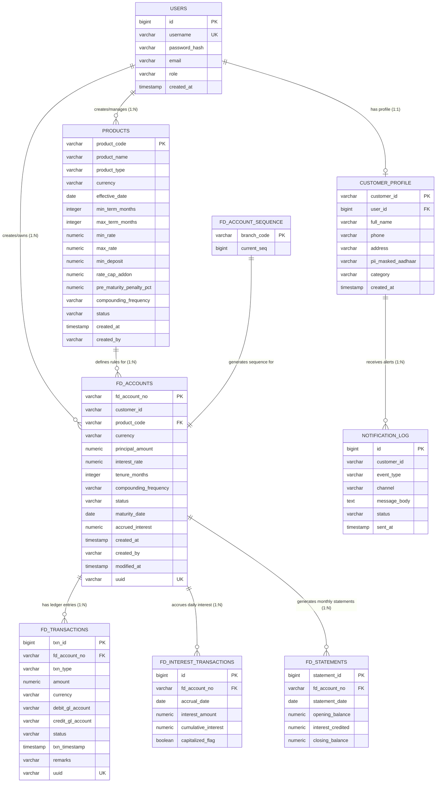

# 🗄️ Fixed Deposit Microservice — Entity-Relationship (ER) Diagram & Database Schema

This document details the database design, entity relationships, constraints, and General Ledger (GL) mappings strictly for the **Fixed Deposit (FD) Microservice**.

---

## 📊 Complete Entity-Relationship (ER) Diagram

The diagram below visualizes all 9 tables in the FD microservice database and their relationships:

---

## 🗂️ Field-by-Field Database Table Specifications

### 1. `users` Table
Stores authentication credentials, user roles, and basic identity metadata.

| Field Name | Data Type | Constraints | Description |
|---|---|---|---|
| `id` | `BIGINT` | Primary Key, Auto Increment | Internal unique user ID |
| `username` | `VARCHAR(50)` | Unique, Not Null | Unique login username |
| `password_hash` | `VARCHAR(255)` | Not Null | Bcrypt hashed password |
| `email` | `VARCHAR(100)` | Nullable | User email address |
| `role` | `VARCHAR(20)` | Default `'CUSTOMER'` | User access role (`CUSTOMER`, `BANK_OFFICER`, `ADMIN`) |
| `created_at` | `TIMESTAMP` | Default `CURRENT_TIMESTAMP` | Registration timestamp |

---

### 2. `customer_profile` Table
Stores customer-specific profile data and PII-masked identifiers.

| Field Name | Data Type | Constraints | Description |
|---|---|---|---|
| `customer_id` | `VARCHAR(20)` | Primary Key | Public customer identifier (e.g., `CUST001`) |
| `user_id` | `BIGINT` | Foreign Key (`users.id`) | Links to security user account |
| `full_name` | `VARCHAR(255)` | Not Null | Customer's legal name |
| `phone` | `VARCHAR(20)` | Nullable | Contact phone number |
| `address` | `VARCHAR(255)` | Nullable | Primary address |
| `pii_masked_aadhaar` | `VARCHAR(20)` | Nullable | Masked national ID (e.g., `XXXX-XXXX-1234`) |
| `category` | `VARCHAR(50)` | Default `'GENERAL'` | Customer category (`SENIOR_CITIZEN`, `STAFF`, `GENERAL`) |
| `created_at` | `TIMESTAMP` | Default `CURRENT_TIMESTAMP` | Profile creation timestamp |

---

### 3. `products` Table
Defines FD banking product offerings, rate ranges, and interest compounding rules.

| Field Name | Data Type | Constraints | Description |
|---|---|---|---|
| `product_code` | `VARCHAR(10)` | Primary Key | Product code (e.g., `FD_STD`, `FD_PREM`) |
| `product_name` | `VARCHAR(255)` | Not Null | Display name of product |
| `product_type` | `VARCHAR(20)` | Default `'FD'` | Product category |
| `currency` | `VARCHAR(3)` | Default `'INR'` | ISO Currency Code (e.g., `INR`, `USD`) |
| `effective_date` | `DATE` | Not Null | Product activation date |
| `min_term_months` | `INTEGER` | Not Null | Minimum allowed tenure in months |
| `max_term_months` | `INTEGER` | Not Null | Maximum allowed tenure in months |
| `min_rate` | `NUMERIC(5,2)` | Not Null | Base interest rate percentage |
| `max_rate` | `NUMERIC(5,2)` | Not Null | Maximum interest rate cap |
| `min_deposit` | `NUMERIC(18,2)`| Not Null | Minimum principal amount required |
| `rate_cap_addon` | `NUMERIC(5,2)`| Default `2.00` | Maximum combined bonus percentage cap |
| `pre_maturity_penalty_pct`| `NUMERIC(5,2)`| Default `1.00` | Early withdrawal penalty percentage |
| `compounding_frequency` | `VARCHAR(20)` | Default `'QUARTERLY'`| Compounding interval (`SIMPLE`, `MONTHLY`, `QUARTERLY`, `YEARLY`) |
| `status` | `VARCHAR(20)` | Default `'ACTIVE'` | Product status (`ACTIVE`, `INACTIVE`) |
| `created_at` | `TIMESTAMP` | Default `CURRENT_TIMESTAMP` | Product creation timestamp |
| `created_by` | `VARCHAR(50)` | Nullable | Admin user who created product |

---

### 4. `fd_accounts` Table
The primary entity representing booked Fixed Deposit accounts.

| Field Name | Data Type | Constraints | Description |
|---|---|---|---|
| `fd_account_no` | `VARCHAR(20)` | Primary Key | 10-digit generated account number `[branch][seq][checksum]` |
| `customer_id` | `VARCHAR(20)` | Not Null | Identifier of account holder |
| `product_code` | `VARCHAR(10)` | Foreign Key (`products.product_code`) | Linked product offering |
| `currency` | `VARCHAR(3)` | Default `'INR'` | Account currency |
| `principal_amount` | `NUMERIC(18,2)`| Not Null | Deposited principal amount |
| `interest_rate` | `NUMERIC(5,2)`| Not Null | Final contracted interest rate |
| `tenure_months` | `INTEGER` | Not Null | FD duration in months |
| `compounding_frequency` | `VARCHAR(20)` | Not Null | Compounding schedule |
| `status` | `VARCHAR(20)` | Default `'ACTIVE'` | State (`ACTIVE`, `CLOSED`, `PREMATURE_CLOSED`) |
| `maturity_date` | `DATE` | Not Null | Scheduled maturity completion date |
| `accrued_interest` | `NUMERIC(18,2)`| Default `0.00` | Current accumulated accrued interest |
| `created_at` | `TIMESTAMP` | Default `CURRENT_TIMESTAMP` | Account opening timestamp |
| `created_by` | `VARCHAR(50)` | Not Null | Bank Officer or System creator |
| `modified_at` | `TIMESTAMP` | Updated automatically | Last status/balance modification |
| `uuid` | `VARCHAR(255)` | Unique, Not Null | Globally unique audit UUID |

---

### 5. `fd_transactions` Table
An **insert-only (append-only)** ledger recording all financial movements with double-entry General Ledger (GL) mappings.

| Field Name | Data Type | Constraints | Description |
|---|---|---|---|
| `txn_id` | `BIGINT` | Primary Key, Auto Increment | Unique transaction ID |
| `fd_account_no` | `VARCHAR(20)` | Foreign Key (`fd_accounts.fd_account_no`) | Linked FD account number |
| `txn_type` | `VARCHAR(20)` | Not Null | Transaction type (`DEPOSIT`, `INTEREST_CREDIT`, `WITHDRAWAL`, `PENALTY`, `MATURITY_PAYOUT`) |
| `amount` | `NUMERIC(18,2)`| Not Null | Transaction monetary amount |
| `currency` | `VARCHAR(3)` | Default `'INR'` | Transaction currency |
| `debit_gl_account` | `VARCHAR(50)` | Not Null | Debit General Ledger account |
| `credit_gl_account` | `VARCHAR(50)` | Not Null | Credit General Ledger account |
| `status` | `VARCHAR(20)` | Default `'COMPLETED'`| State (`COMPLETED`, `FAILED`) |
| `txn_timestamp` | `TIMESTAMP` | Default `CURRENT_TIMESTAMP` | Execution timestamp |
| `remarks` | `VARCHAR(500)`| Nullable | Audit remarks |
| `uuid` | `VARCHAR(255)` | Unique, Not Null | Globally unique transaction UUID |

---

### 6. `fd_interest_transactions` Table
Records daily interest accrual entries computed by the automated batch job.

| Field Name | Data Type | Constraints | Description |
|---|---|---|---|
| `id` | `BIGINT` | Primary Key, Auto Increment | Accrual record ID |
| `fd_account_no` | `VARCHAR(20)` | Foreign Key (`fd_accounts.fd_account_no`) | Linked FD account |
| `accrual_date` | `DATE` | Not Null | Date of daily accrual |
| `interest_amount` | `NUMERIC(18,4)`| Not Null | Daily interest accrued amount |
| `cumulative_interest`| `NUMERIC(18,4)`| Not Null | Cumulative lifetime interest accrued |
| `capitalized_flag` | `BOOLEAN` | Default `FALSE` | Indicates if interest was added to principal |

---

### 7. `fd_statements` Table
Stores monthly summary statements generated on the 1st of each month.

| Field Name | Data Type | Constraints | Description |
|---|---|---|---|
| `statement_id` | `BIGINT` | Primary Key, Auto Increment | Statement entry ID |
| `fd_account_no` | `VARCHAR(20)` | Foreign Key (`fd_accounts.fd_account_no`) | Linked FD account |
| `statement_date` | `DATE` | Not Null | Statement period end date |
| `opening_balance` | `NUMERIC(18,2)`| Not Null | Month opening principal balance |
| `interest_credited` | `NUMERIC(18,2)`| Not Null | Total interest accrued during the month |
| `closing_balance` | `NUMERIC(18,2)`| Not Null | Month closing balance ($\text{Opening} + \text{Interest}$) |

---

### 8. `fd_account_sequence` Table
Maintains atomic branch sequence counters for the account generator.

| Field Name | Data Type | Constraints | Description |
|---|---|---|---|
| `branch_code` | `VARCHAR(3)` | Primary Key | 3-digit branch code (e.g., `'001'`) |
| `current_seq` | `BIGINT` | Not Null | Last assigned 6-digit sequence number |

---

### 9. `notification_log` Table
Stores audit logs for all outbound customer email and event notifications.

| Field Name | Data Type | Constraints | Description |
|---|---|---|---|
| `id` | `BIGINT` | Primary Key, Auto Increment | Log entry ID |
| `customer_id` | `VARCHAR(20)` | Not Null | Target customer ID |
| `event_type` | `VARCHAR(50)` | Not Null | Life-cycle trigger event (`FD_OPENED`, `FD_MATURED`, `FD_WITHDRAWN`) |
| `channel` | `VARCHAR(20)` | Default `'EMAIL'` | Dispatch channel |
| `message_body` | `TEXT` | Not Null | Complete notification text |
| `status` | `VARCHAR(20)` | Default `'SENT'` | Delivery status (`SENT`, `FAILED`) |
| `sent_at` | `TIMESTAMP` | Default `CURRENT_TIMESTAMP` | Timestamp of dispatch |

---

## 🏛️ General Ledger (GL) Account Mappings

| Transaction Type | Debit GL Account | Credit GL Account | Purpose |
|---|---|---|---|
| **Initial Deposit** | `ASSET_CUSTOMER_REMITTANCE` | `LIABILITY_FD_DEPOSITS` | Receives initial customer funds into bank's FD liability |
| **Interest Credit** | `EXPENSE_INTEREST_PAID` | `LIABILITY_FD_DEPOSITS` | Records interest expense and increases customer FD liability |
| **Premature Withdrawal** | `LIABILITY_FD_DEPOSITS` | `ASSET_CUSTOMER_SAVINGS` | Reduces FD liability and credits payout to customer savings |
| **Penalty Deduction** | `LIABILITY_FD_DEPOSITS` | `INCOME_PREMATURE_PENALTY` | Deducts early closure fee into bank penalty income |
| **Maturity Payout** | `LIABILITY_FD_DEPOSITS` | `ASSET_CUSTOMER_SAVINGS` | Settles full matured balance to customer savings |
