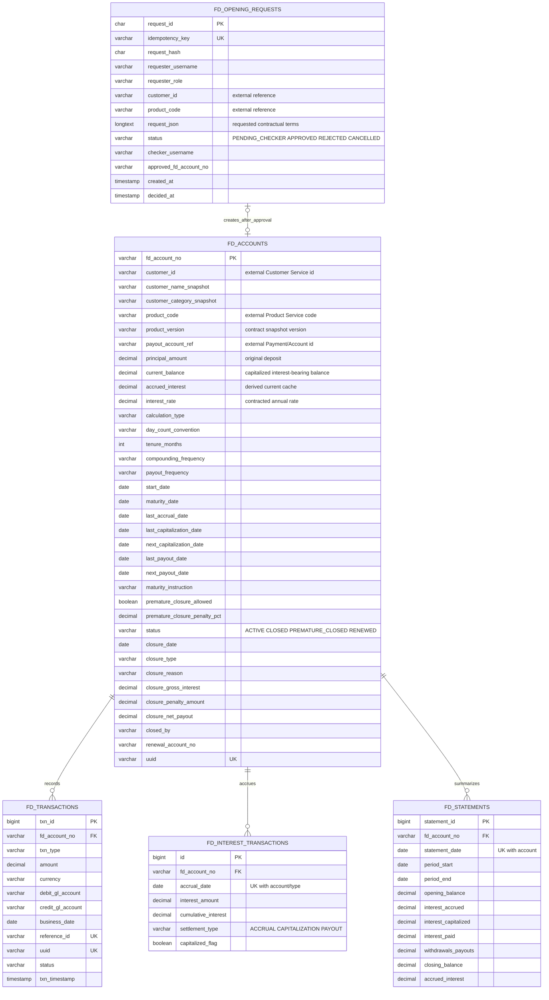
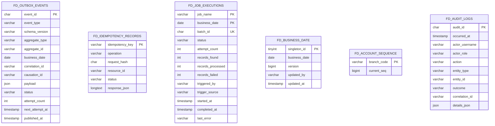

# FD Account Service — Database-Per-Service ER Model

This diagram contains only FD-owned production data. Identity, Customer, Product/Pricing, Notification, Reporting, Audit, Accounting and Payment are separate bounded contexts. `customer_id`, `product_code` and `payout_account_ref` are external identifiers—not cross-service foreign keys.

```mermaid
erDiagram
    FD_ACCOUNTS ||--o{ FD_TRANSACTIONS : records
    FD_ACCOUNTS ||--o{ FD_INTEREST_TRANSACTIONS : accrues
    FD_ACCOUNTS ||--o{ FD_STATEMENTS : summarizes
    FD_OPENING_REQUESTS o|--o| FD_ACCOUNTS : creates_after_approval

    FD_ACCOUNTS {
        varchar fd_account_no PK
        varchar customer_id "external Customer Service id"
        varchar customer_name_snapshot
        varchar customer_category_snapshot
        varchar product_code "external Product Service code"
        varchar product_version "contract snapshot version"
        varchar payout_account_ref "external Payment/Account id"
        decimal principal_amount "original deposit"
        decimal current_balance "capitalized interest-bearing balance"
        decimal accrued_interest "derived current cache"
        decimal interest_rate "contracted annual rate"
        varchar calculation_type
        varchar day_count_convention
        int tenure_months
        varchar compounding_frequency
        varchar payout_frequency
        date start_date
        date maturity_date
        date last_accrual_date
        date last_capitalization_date
        date next_capitalization_date
        date last_payout_date
        date next_payout_date
        varchar maturity_instruction
        boolean premature_closure_allowed
        decimal premature_closure_penalty_pct
        varchar status "ACTIVE CLOSED PREMATURE_CLOSED RENEWED"
        date closure_date
        varchar closure_type
        varchar closure_reason
        decimal closure_gross_interest
        decimal closure_penalty_amount
        decimal closure_net_payout
        varchar closed_by
        varchar renewal_account_no
        varchar uuid UK
    }

    FD_TRANSACTIONS {
        bigint txn_id PK
        varchar fd_account_no FK
        varchar txn_type
        decimal amount
        varchar currency
        varchar debit_gl_account
        varchar credit_gl_account
        date business_date
        varchar reference_id UK
        varchar uuid UK
        varchar status
        timestamp txn_timestamp
    }

    FD_INTEREST_TRANSACTIONS {
        bigint id PK
        varchar fd_account_no FK
        date accrual_date "UK with account/type"
        decimal interest_amount
        decimal cumulative_interest
        varchar settlement_type "ACCRUAL CAPITALIZATION PAYOUT"
        boolean capitalized_flag
    }

    FD_STATEMENTS {
        bigint statement_id PK
        varchar fd_account_no FK
        date statement_date "UK with account"
        date period_start
        date period_end
        decimal opening_balance
        decimal interest_accrued
        decimal interest_capitalized
        decimal interest_paid
        decimal withdrawals_payouts
        decimal closing_balance
        decimal accrued_interest
    }

    FD_OPENING_REQUESTS {
        char request_id PK
        varchar idempotency_key UK
        char request_hash
        varchar requester_username
        varchar requester_role
        varchar customer_id "external reference"
        varchar product_code "external reference"
        longtext request_json "requested contractual terms"
        varchar status "PENDING_CHECKER APPROVED REJECTED CANCELLED"
        varchar checker_username
        varchar approved_fd_account_no
        timestamp created_at
        timestamp decided_at
    }
```

## FD reliability tables

```mermaid
erDiagram
    FD_OUTBOX_EVENTS {
        char event_id PK
        varchar event_type
        varchar schema_version
        varchar aggregate_type
        varchar aggregate_id
        date business_date
        varchar correlation_id
        varchar causation_id
        json payload
        varchar status
        int attempt_count
        timestamp next_attempt_at
        timestamp published_at
    }
    FD_IDEMPOTENCY_RECORDS {
        varchar idempotency_key PK
        varchar operation
        char request_hash
        varchar resource_id
        varchar status
        longtext response_json
    }
    FD_JOB_EXECUTIONS {
        varchar job_name PK
        date business_date PK
        char batch_id UK
        varchar status
        int attempt_count
        int records_found
        int records_processed
        int records_failed
        varchar triggered_by
        varchar trigger_source
        timestamp started_at
        timestamp completed_at
        varchar last_error
    }
    FD_BUSINESS_DATE {
        tinyint singleton_id PK
        date business_date
        bigint version
        varchar updated_by
        timestamp updated_at
    }
    FD_ACCOUNT_SEQUENCE {
        varchar branch_code PK
        bigint current_seq
    }
    FD_AUDIT_LOGS {
        char audit_id PK
        timestamp occurred_at
        varchar actor_username
        varchar actor_role
        varchar action
        varchar entity_type
        varchar entity_id
        varchar outcome
        varchar correlation_id
        json details_json
    }
```

`FD_ACCOUNT_SEQUENCE` is a branch-level technical number generator and therefore has no one-to-one business relationship with an FD. `FD_AUDIT_LOGS` is the FD service's local operational audit trail; the independent Audit Service also consumes Kafka and maintains its own cross-service audit database.

## Separate service databases

| Service | Owned database/read model | Input |
|---|---|---|
| Identity | users, credentials, roles | authenticated administrative provisioning |
| Customer | profile, KYC, verified categories | customer APIs/events |
| Product/Pricing | products, versions, pricing rules | product administration |
| Notification | inbox, delivery attempts/status | Kafka lifecycle events |
| Reporting | inbox, FD account read model | Kafka lifecycle events |
| Audit | inbox, immutable event audit | Kafka lifecycle events |
| Accounting | inbox, journal entries | `FD_TRANSACTION_RECORDED` |
| Payment/Savings | customer account and settlement ledger | payout/debit commands and result events |

The local demonstration can enable Identity/Customer/Product adapters inside the FD application for deterministic seed data. Those adapter tables are excluded from the FD production ER model and have no relationship or foreign key to `fd_accounts`.
