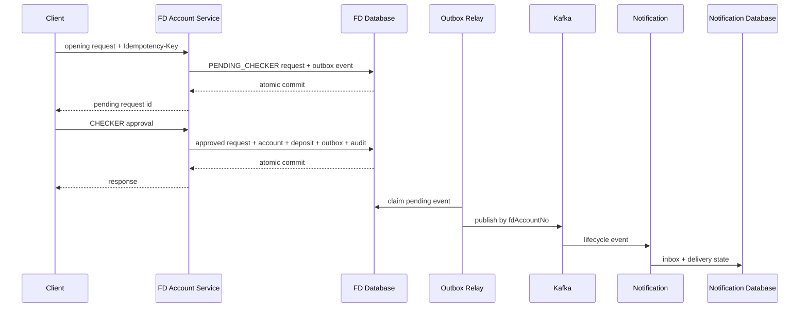

# FD Account Service — ER Diagram

This is the bounded-context data model for the Fixed Deposit account service. It is intentionally separate from Customer, Identity, Notification, Reporting, and other banking modules.

`customer_id` and `product_code` are external identifiers. They are not database foreign keys and must be resolved or validated through versioned APIs/events when the team services are connected. Internal foreign keys are retained only between tables owned by this FD service; that does not violate microservice isolation.

```mermaid
erDiagram
    FD_ACCOUNTS ||--o{ FD_TRANSACTIONS : records
    FD_ACCOUNTS ||--o{ FD_INTEREST_TRANSACTIONS : accrues
    FD_ACCOUNTS ||--o{ FD_STATEMENTS : summarizes
    FD_ACCOUNTS ||--o{ FD_OUTBOX_EVENTS : emits
    PRODUCTS ||--o{ PRODUCT_COMPOUNDING_OPTIONS : permits
    PRODUCTS ||--o{ PRODUCT_PAYOUT_OPTIONS : permits
    FD_OPENING_REQUESTS ||--o{ FD_OUTBOX_EVENTS : emits

    FD_ACCOUNTS {
        varchar fd_account_no PK
        varchar customer_id "external reference; no FK"
        varchar customer_name_snapshot "owner at booking"
        varchar customer_category_snapshot "eligibility at booking"
        varchar product_code "booked product reference; no FK"
        varchar currency
        decimal principal_amount
        decimal current_balance
        decimal accrued_interest
        decimal interest_rate
        varchar day_count_convention
        int tenure_months
        varchar compounding_frequency
        varchar payout_frequency
        date start_date
        date maturity_date
        date last_accrual_date
        date last_capitalization_date
        date next_capitalization_date
        date last_payout_date
        date next_payout_date
        varchar maturity_instruction
        boolean premature_closure_allowed
        decimal premature_closure_penalty_pct
        varchar status
        timestamp maturity_processed_at
        date closure_date "actual settlement date"
        varchar closure_type "PREMATURE or maturity outcome"
        varchar closure_reason
        decimal closure_gross_interest
        decimal closure_penalty_amount
        decimal closure_net_payout
        varchar closure_transfer_account_masked
        varchar closed_by
        varchar renewal_account_no
        varchar uuid UK
    }

    FD_TRANSACTIONS {
        bigint txn_id PK
        varchar fd_account_no FK
        varchar txn_type
        decimal amount
        varchar currency
        varchar debit_gl_account
        varchar credit_gl_account
        date business_date
        varchar reference_id UK
        varchar status
    }

    FD_INTEREST_TRANSACTIONS {
        bigint id PK
        varchar fd_account_no FK
        date accrual_date
        decimal interest_amount
        decimal cumulative_interest
        varchar settlement_type
        boolean capitalized_flag
    }

    FD_STATEMENTS {
        bigint statement_id PK
        varchar fd_account_no FK
        date statement_date
        decimal opening_balance
        decimal interest_accrued
        decimal interest_capitalized
        decimal interest_paid
        decimal closing_balance
        decimal accrued_interest
    }

    FD_OUTBOX_EVENTS {
        varchar event_id PK
        varchar aggregate_type
        varchar aggregate_id
        varchar event_type
        varchar topic
        varchar partition_key
        json payload
        varchar status
        int attempt_count
        timestamp next_attempt_at
        timestamp published_at
    }

    PRODUCTS {
        varchar product_code PK
        varchar product_name
        varchar currency
        decimal min_rate
        decimal max_rate
        decimal min_deposit
        decimal max_deposit
        int min_term_months
        int max_term_months
        decimal rate_cap_addon
        boolean category_addons_stackable "sum+cap vs highest only"
        boolean premature_closure_allowed
        decimal pre_maturity_penalty_pct
        varchar day_count_convention
        varchar status
    }

    PRODUCT_COMPOUNDING_OPTIONS {
        varchar product_code FK
        varchar frequency
    }

    PRODUCT_PAYOUT_OPTIONS {
        varchar product_code FK
        varchar frequency
    }

    FD_OPENING_REQUESTS {
        char request_id PK
        varchar idempotency_key UK
        char request_hash
        varchar requester_username
        varchar requester_role
        varchar customer_id "external reference; no FK"
        varchar customer_name_snapshot
        varchar product_code "external/booked reference; no FK"
        decimal principal_amount
        varchar status "PENDING_CHECKER APPROVED REJECTED CANCELLED"
        varchar checker_username
        varchar approved_fd_account_no "reference; no FK"
        timestamp created_at
        timestamp decided_at
    }

    FD_AUDIT_LOGS {
        char audit_id PK
        timestamp occurred_at
        varchar actor_username
        varchar actor_role
        varchar action
        varchar entity_type
        varchar entity_id
        varchar outcome
        varchar correlation_id
        json details_json
    }

    FD_ACCOUNT_SEQUENCE {
        varchar branch_code PK
        bigint current_seq
    }

    FD_IDEMPOTENCY_RECORDS {
        varchar idempotency_key PK
        varchar operation
        char request_hash
        varchar resource_id
        longtext response_json
        varchar status
        timestamp completed_at
    }

    FD_JOB_EXECUTIONS {
        varchar job_name PK
        date business_date PK
        varchar status
        int attempt_count
        timestamp started_at
        timestamp completed_at
    }
```

## Ownership rules

- The FD service is the only writer to the tables above.
- Reporting calls authenticated FD APIs; it never connects to the FD database.
- Notifications consume `fd.lifecycle.v1` and write only to `notification_db`.
- Kafka publication uses `fd_outbox_events`, written in the same local transaction as the FD change.
- `fd_idempotency_records` prevents duplicate account opening and rejects key reuse with a changed payload.
- `fd_opening_requests` is the maker-checker command ledger. Human users cannot call the internal account-creation endpoint directly; approval invokes it with an approval-derived idempotency key.
- `fd_audit_logs` is append-only through the application API and captures workflow, configuration, batch and lifecycle actions. A future enterprise audit consumer can subscribe to the same Kafka boundary.
- `fd_job_executions` provides a single distributed claim per job/business date; account-level financial handlers retain their own idempotency checks.
- Historic rows from the old shared notification design are preserved as `legacy_notification_log_archive`; no runtime component reads or writes that archive.

## Event flow

```mermaid
sequenceDiagram
    participant Client
    participant FD as FD Account Service
    participant DB as FD Database
    participant Relay as Outbox Relay
    participant Kafka
    participant Notification
    participant NDB as Notification Database

    Client->>FD: opening request + Idempotency-Key
    FD->>DB: PENDING_CHECKER request + outbox event
    DB-->>FD: atomic commit
    FD-->>Client: pending request id
    Client->>FD: CHECKER approval
    FD->>DB: approved request + account + deposit + outbox + audit
    DB-->>FD: atomic commit
    FD-->>Client: response
    Relay->>DB: claim pending event
    Relay->>Kafka: publish by fdAccountNo
    Kafka->>Notification: lifecycle event
    Notification->>NDB: inbox + delivery state
```
